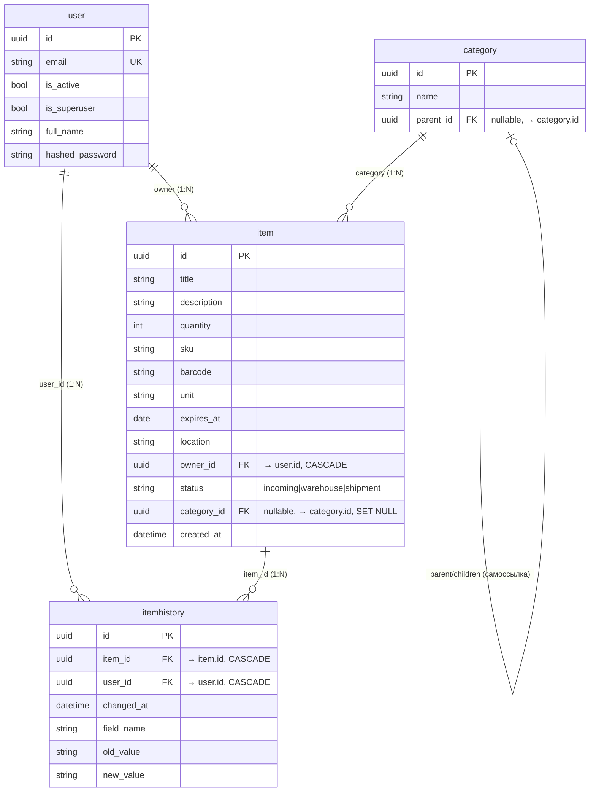

# Схема бэкенда «Склад»

Диаграмма связей между таблицами (моделями SQLModel).

## ER-диаграмма (Mermaid)

## Краткое описание связей

| Таблица       | Связь              | Описание |
|---------------|--------------------|----------|
| **user**      | → item (1:N)       | Один пользователь — много товаров. Удаление пользователя удаляет его товары (CASCADE). |
| **user**      | → itemhistory (1:N)| Кто внёс изменение в историю. |
| **category**  | → category (само)  | Иерархия: parent_id указывает на родительскую категорию. При удалении родителя у детей parent_id = NULL (SET NULL). |
| **category**  | → item (1:N)       | Одна категория — много товаров. У товара category_id опционален. При удалении категории у товаров category_id = NULL (SET NULL). |
| **item**      | → itemhistory (1:N)| История изменений полей товара. Удаление товара удаляет его историю (CASCADE). |

## Статусы Item

- `incoming` — поступления  
- `warehouse` — на складе  
- `shipment` — в отгрузке  

## Не-табличные модели (Pydantic, только API)

- **UserCreate, UserUpdate, UserPublic, UsersPublic** — пользователи  
- **CategoryCreate, CategoryUpdate, CategoryPublic** — категории  
- **ItemCreate, ItemUpdate, ItemPublic, ItemsPublic** — товары  
- **ItemHistoryPublic, ItemHistoryList** — история  
- **Message, Token, TokenPayload, NewPassword, UpdatePassword** — авторизация и ответы API  
